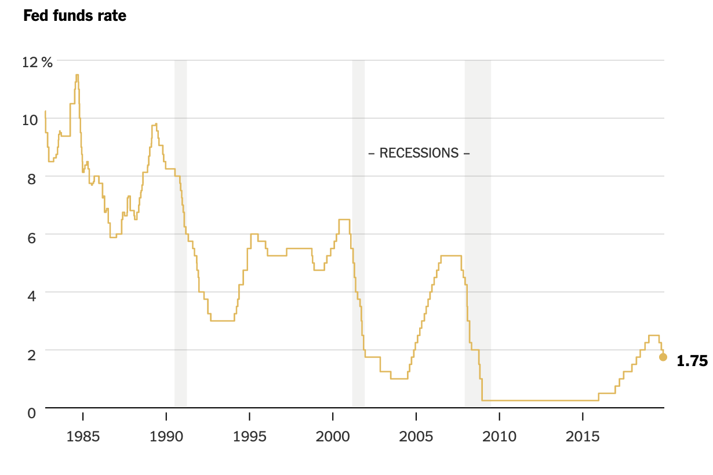

# Interest rate

## Stock Market

Immediately affect the financial markets, needs at least 12 months to affect economy.

Interest rate increase, the percentage of **loan** increase, then the equity will decrease relatively.

Since the future **cash flow** is discounted more, the loss of value of the stock will lead to the price falldown.

Some sectors do benefit from interest rate hikes. One sector that tends to benefit most is the **financial industry** who charges lending.

Lower rates **encourage lending and spending** by consumers and businesses.

## Monetary Tools

Discount (Interest) rate

Required Reserves

Open market operations

Interest on Reserves

## Meet

Mid Nov. 2019

“Everything was discussed including interest rates, negative interest, low inflation, easing, Dollar strength & its effect on manufacturing, trade with China, E.U. & others, etc.,” said Mr. Trump. He later said, “I protested fact that our Fed Rate is set too high relative to the interest rates of **other competitor countries**,” adding that it should be lower than theirs.

Mr. Powell reiterated that he hoped interest-rate cuts earlier this year would **bolster the economy**. 

The central bank said Mr. Powell’s comments to Mr. Trump were consistent with his remarks last week. He then [expressed optimism](https://www.wsj.com/articles/jerome-powell-to-testify-before-house-budget-committee-on-economic-outlook-11573736401?mod=article_inline) that the Fed’s interest-rate cuts this year would buoy the U.S. economy against lingering risks, including decelerating global growth and any fallout from uncertainty that has been amplified by the U.S.-China trade war.

## Third Cut in 2019

This week’s decision to lower rates was intended to “provide some insurance **against ongoing risks**,” Mr. Powell said, adding that the United States economy remains strong. “Over all, we see the economy as having been resilient to the winds that have been blowing this year,” he said.

The Fed has now reduced its policy rate by a cumulative 0.75 percentage point this year, just as it did during two mid-business-cycle interest rate adjustments in the 1990s. While those insurance cut cycles were eventually reversed — the Fed returned to interest rate increases — Mr. Powell indicated that increases were not on the table unless inflation showed signs of moving higher.

## Next time

Dec. 11th, 2019

## Reference Article

[Powell Meets With Trump, a Frequent Critic, to Discuss Economy](<https://www.wsj.com/articles/fed-chairman-powell-trump-meet-discuss-economy-11574092396?mod=searchresults&page=1&pos=5&mod=article_inline>)

[How Do Interest Rates Affect the Stock Market?](<https://www.investopedia.com/investing/how-interest-rates-affect-stock-market/>)

[How Monetary Policy Works](<https://www.stlouisfed.org/in-plain-english/how-monetary-policy-works>)

[Federal Reserve Cuts Interest Rates for Third Time in 2019](<https://www.nytimes.com/2019/10/30/business/economy/federal-reserve-interest-rates.html>)
