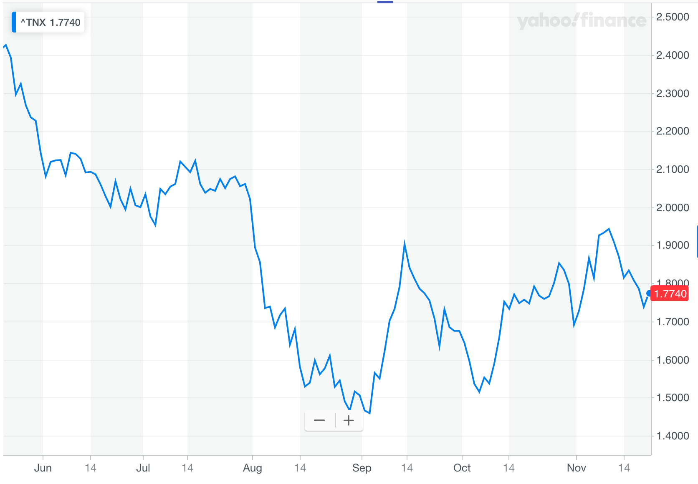
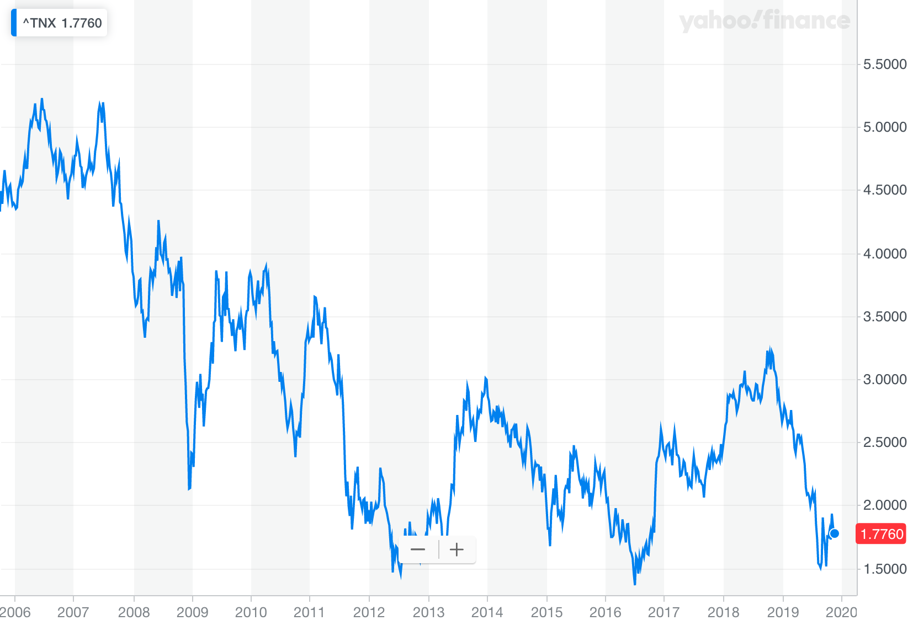
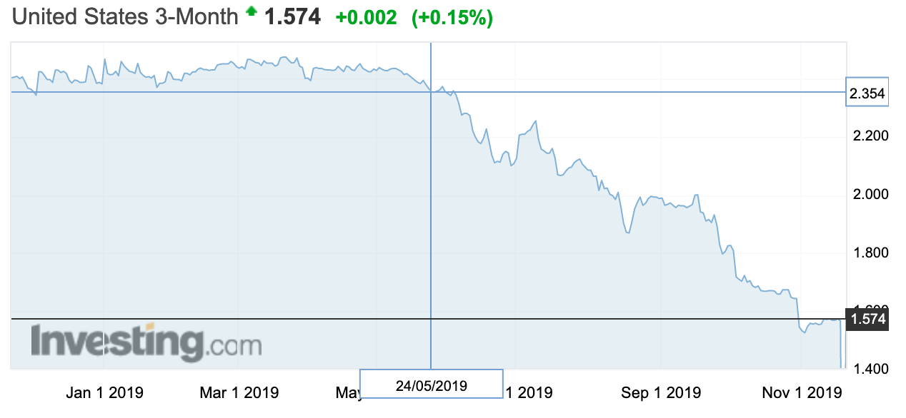
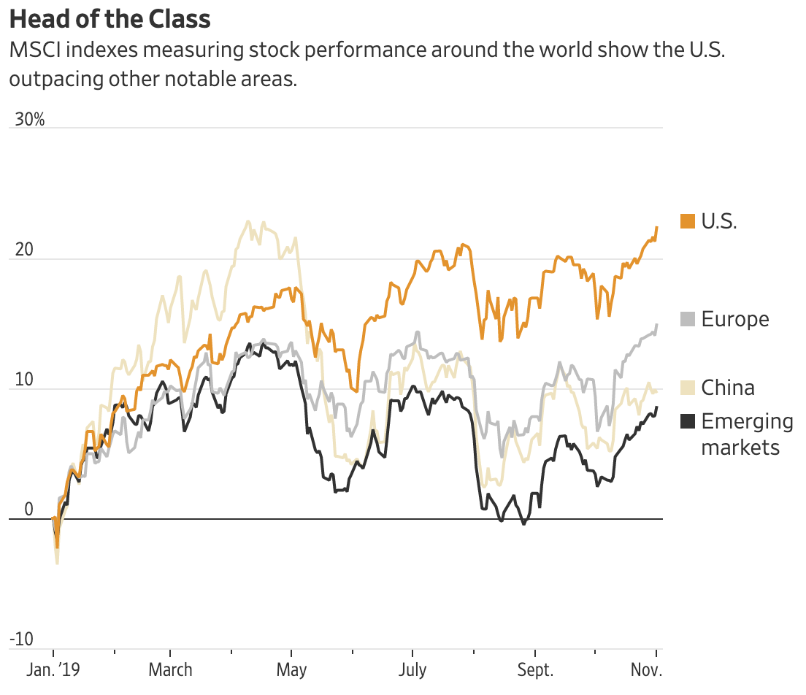

# Other Topics

## Retail

[U.S. Retail Sales Rebounded in October](<https://www.wsj.com/articles/u-s-retail-sales-rebounded-in-october-11573824926?mod=searchresults&page=1&pos=9>)

[Retailer Results Send Mixed Signals on Consumer Spending](<https://www.wsj.com/articles/retailers-give-mixed-read-on-consumer-spending-11574173235?mod=hp_lead_pos1>)

[Stocks Waver on Disappointing Retail Earnings](<https://www.wsj.com/articles/global-stocks-edge-higher-as-investors-see-fewer-risks-11574159706?mod=searchresults&page=1&pos=1>)

[Why do financial markets most often focus on quarterly results at the expense of the long-term approach? Will financial markets accept long-term corporate policies?](<https://www.quora.com/Why-do-financial-markets-most-often-focus-on-quarterly-results-at-the-expense-of-the-long-term-approach-Will-financial-markets-accept-long-term-corporate-policies>)

**United States Retail Sales YoY** Nov. 15th 3.1% Oct. 16th 4.1%

## Treasury Yields

[Rising Treasury Yields Quiet Investors’ Concerns](<https://www.wsj.com/articles/rising-treasury-yields-quiet-investors-concerns-11573736400?mod=searchresults&page=1&pos=18>)

[Treasury Yields Extend Slide Amid Trade and Economic Concerns -- MarketWatch](<https://www.wsj.com/articles/german-bund-yields-drop-despite-better-than-expected-3q-gdp-data-11573717845?mod=searchresults&page=1&pos=17>)

### Increasing during Oct. 2019

Those include the Federal Reserve’s cuts to short-term interest rates, steps toward a trade agreement by the U.S. and China and a series of economic reports that turned out better than some investors had feared.

Some investors say the rise of 10-year yieldsabove three-month yields is a positive sign forthe economy.

Yields on longer-term Treasurys also slipped below shorter-term yields, a phenomenon known as an inverted yield-curve, which has proved one of the financial markets’ best predictors of a looming recession.

The 10-year yield remains very low—sitting closer to the all-time low of 1.366% it reached in 2016 than the 3.2% level it briefly hit about a year ago when the Fed was still raising interest rates.

Nonetheless, many investors think yields have room to rise as more people sell bonds to buy riskier assets. 

- cuts to short-term interest rates
- a trade agreement by the U.S. and China

Postive signal for economy, from reverted to higher than 3-month rate

Maybe still low, since money out of debts into riskier assets

### Recent Decrease

U.S. Treasury yields slipped Thursday as investors eyed **weakening economic data in Asia**, along with **political jitters** around the globe and **uncertain progress** toward a partial U.S.-China trade pact.

...

...

## Performance

[U.S. Stocks Outpacing the Rest of the World](<https://www.wsj.com/articles/u-s-stocks-outpacing-the-rest-of-the-world-11572863400?mod=searchresults&page=1&pos=10>)

[The Fed Gives Investors a Green Light](<https://www.wsj.com/articles/the-fed-gives-investors-a-green-light-11573666302?mod=searchresults&page=3&pos=1>)

[For Stocks, Three Fed Rate Cuts Tends to Be Sweet Spot](<https://www.wsj.com/articles/for-stocks-three-fed-rate-cuts-tends-to-be-sweet-spot-11572609600?mod=searchresults&page=1&pos=13>)

Relatively good performance in this year

The **MSCI USA index is up 23%** for the year, while gauges for Europe, China and emerging markets are up about 16%, 12% and 10%, respectively.

The trend shows how **steady consumer spending** and **strength in the labor market** keep supporting U.S. stocks despite fears of a recession and outsize moves toward haven assets like bonds and gold.

**umemployment rate**  OCT 2019 3.6%

- **economic costs of unemployment**

  

**Consumer spending** (not recent)

  

## Investment Trend

### Value Stocks

[Value Stocks Are Back in Vogue, for Now](<https://www.wsj.com/articles/value-stocks-are-back-in-vogue-for-now-11574073000?mod=searchresults&page=1&pos=18>)

### High tech

[Technology Stocks Head Toward Best Year Since 2009](<https://www.wsj.com/articles/technology-stocks-head-toward-best-year-since-2009-11574159401>)

### Big Stocks

[Big Stocks Give S&P 500 An Edge](<https://www.wsj.com/articles/big-stocks-give-s-p-500-an-edge-11574185528?tesla=y&mod=article_inline>)

