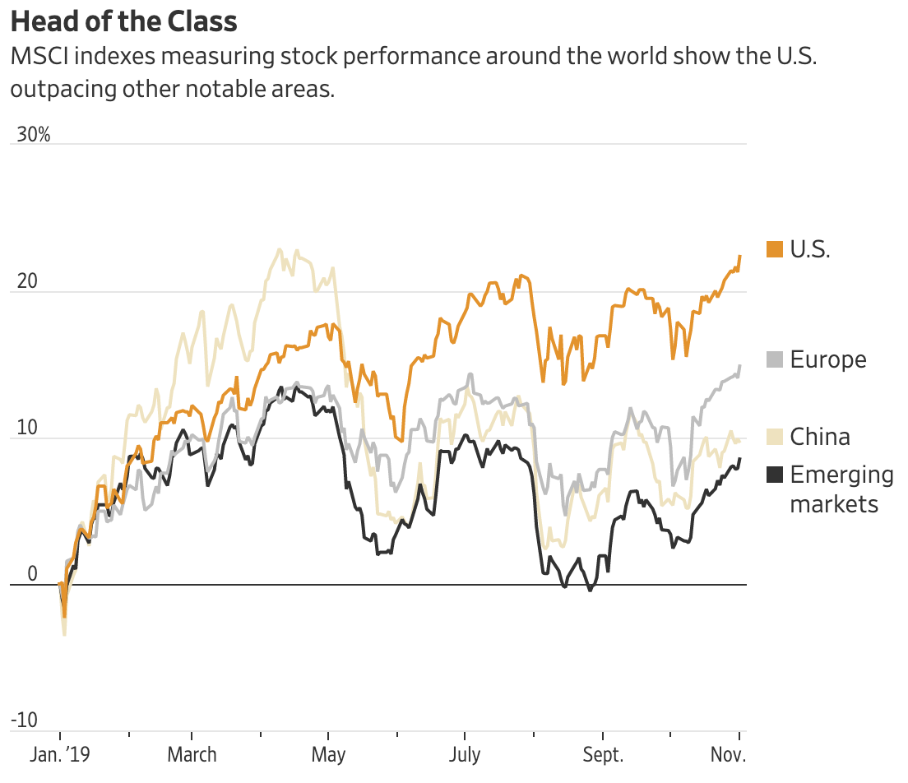

# Performance

[U.S. Stocks Outpacing the Rest of the World](<https://www.wsj.com/articles/u-s-stocks-outpacing-the-rest-of-the-world-11572863400?mod=searchresults&page=1&pos=10>)

[The Fed Gives Investors a Green Light](<https://www.wsj.com/articles/the-fed-gives-investors-a-green-light-11573666302?mod=searchresults&page=3&pos=1>)

[For Stocks, Three Fed Rate Cuts Tends to Be Sweet Spot](<https://www.wsj.com/articles/for-stocks-three-fed-rate-cuts-tends-to-be-sweet-spot-11572609600?mod=searchresults&page=1&pos=13>)

Relatively good performance in this year

The **MSCI USA index is up 23%** for the year, while gauges for Europe, China and emerging markets are up about 16%, 12% and 10%, respectively.

The trend shows how **steady consumer spending** and **strength in the labor market** keep supporting U.S. stocks despite fears of a recession and outsize moves toward haven assets like bonds and gold.

**umemployment rate**  OCT 2019 3.6%

- **economic costs of unemployment**

  

**Consumer spending** (not recent)

  

## 