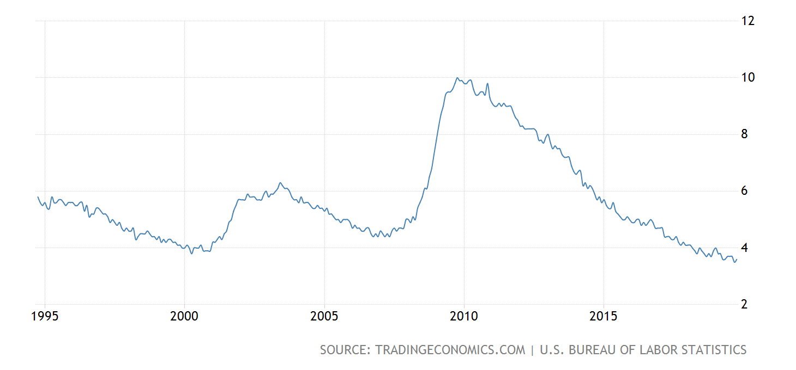
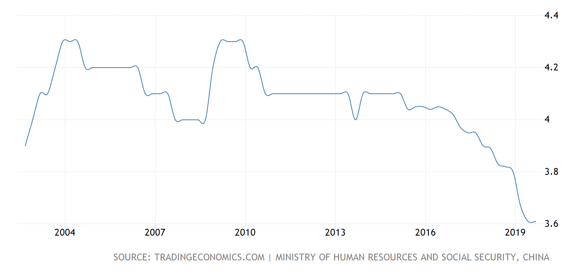
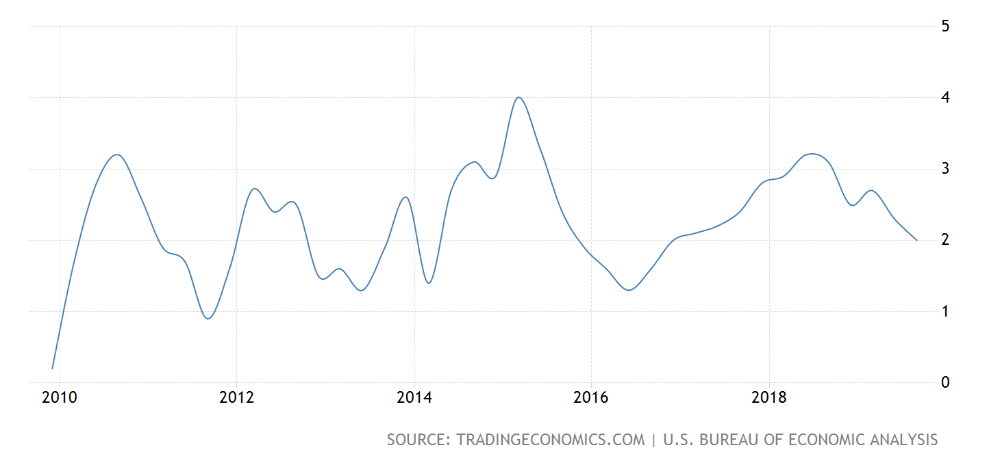
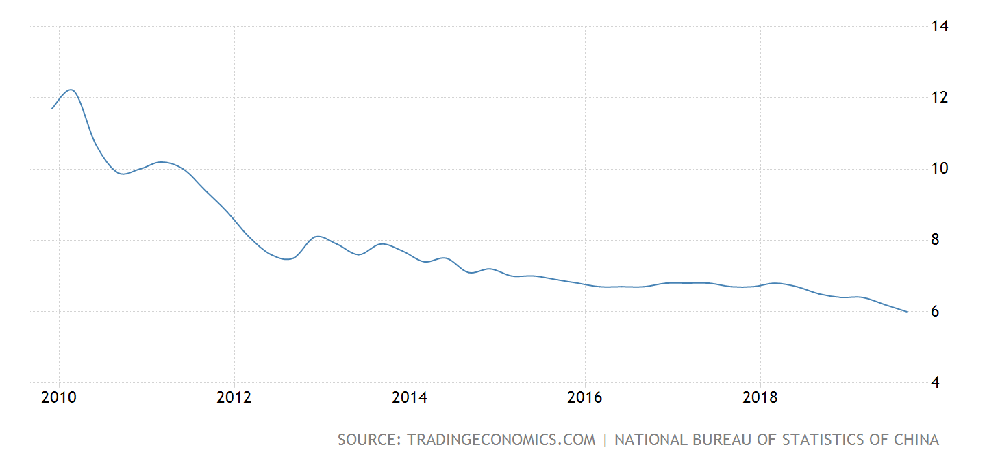

#Trade War

## Timeline

| Time        |                                                              |
| ----------- | ------------------------------------------------------------ |
| March 2018  | US imposes a 25 percent tariff on all steel imports          |
| April 2018  | China [imposes tariffs](https://www.china-briefing.com/news/2018/04/03/us-china-trade-war-us-products-affected.html) (ranging 15-25 percent) on 128 products (worth US$3 billion) including fruit, wine, seamless steel pipes, pork and recycled aluminium in retaliation to the US’ steel and aluminium tariffs. |
|             | The USTR releases an initial list of 1,334 proposed products (worth US$50 billion) subject to a potential 25 percent tariff (list revised June 15) |
|             | China reacts to USTR’s initial list, and proposes 25 percent tariffs to be applied on 106 products (worth US$50 billion) on goods such as soybeans, automobile, chemicals (list revised on June 16) |
| May 2018    | FIrst trade talk in Beijing, US and China agree to [put the trade war on hold](https://www.china-briefing.com/news/2018/05/23/china-us-suspend-trade-war.html) after China reportedly agrees to buy more US goods. |
| June 2018   | list reduced, both 25 percent tariff                         |
| July 2018   | L1 start US steel and iron products, CN agricultural products, automobile **Start of Trade War** |
| August 2018 | L3 US from 10% to 25%, China range 5 - 25% L2 start both 25% |
| Sept 2018   | L3 start US, then China stop the trade talks, then China L3 start |
| Dec 2018    | Truce of trade war                                           |
| 1-4 2019    | Talk                                                         |
| May 2019    | new increase tariff                                          |
| June 2019   | China L1 - L4 5 percent to 25 percent G20 truce and president re |
| August 2019 | China agriculture products                                   |
| Sept 2019   | US L4A China more on L1                                      |
| 10-11 2019  | Phase 1 Deal and rollback but Trump may retreat the deal     |

## Phase 1 Deal？

rollback

high tech

more agricultural products import

open investment

## Reasons 

###Cycle

10 years weak, 6 years strong

since 1971 without the relationship with gold

1981 **Falkland Islands** war till 1986

then weak though Janpan

1997 Thailand Financial Crisis to Asian Area

2002 districtional crisis maker?

2008 financial crisis, mortgage really hurts united states, so the weak time is long

2015 till now South China Sea Hong Kong Problem and Trade War

###Good timing

14 QE $\to$ FX Reserve increasing

China 4 trillion CNY save the market then the higher price in real estate market, highly debt for young especially, and great trade war for United States

reduce the FX Reserve; keep the status of dollars

## Unemployment rate

Since end of Financial Crisis in 2010, unemployment rate kept decreasing. Maybe not from the tariff, Sep 3.5% Oct 3.6%

### short term

domestic producer: + receive more orders from local; foreign producers higher cost; lead to more employment of workers

foreign producer: - higher cost on material, less profit, less work

### long term

foreign country retaliate $\to$ more cost, export producer down, economic growth down, create more layoffs, not less

## Consumers

###US

China is global supply chain, biggest manufacting hub

American companies need Chinese factory, so hurt more on American

Spend 1 dollar, 0.55 dollar will be back to america

Hurt may not feel but exist to America consumers

Cost $\to$ producer $\to$ consumer need time to feel the war during supply chain

###China

For China, the same problem 0.55 vs 1 at least

decrease in some province, but not all

## Conclusion

It's good time for trade war, but not good results for United States (till now)

Both of them are trying to delay the war into a long-term war

China needs time for development, US needs time for operation.  

## Some Charts 

us unemployment rate

china unemployment rate

us GDP growth rate YoY

China GDP growth rate YoY

