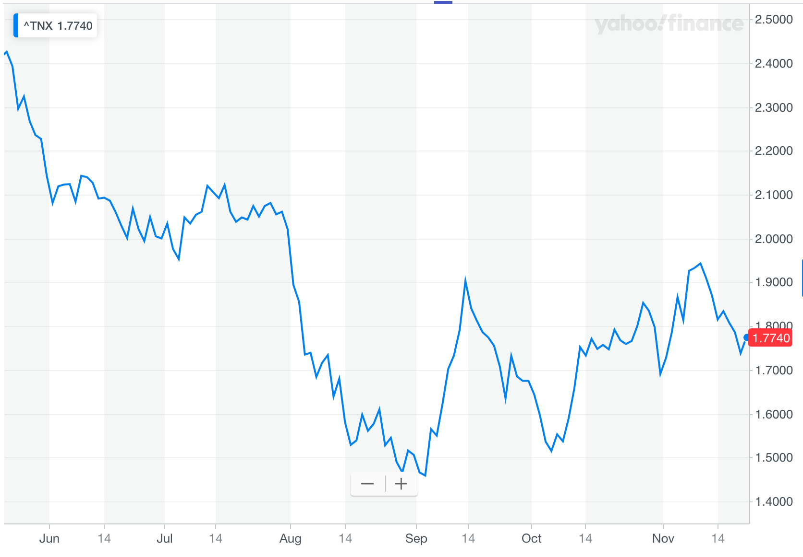
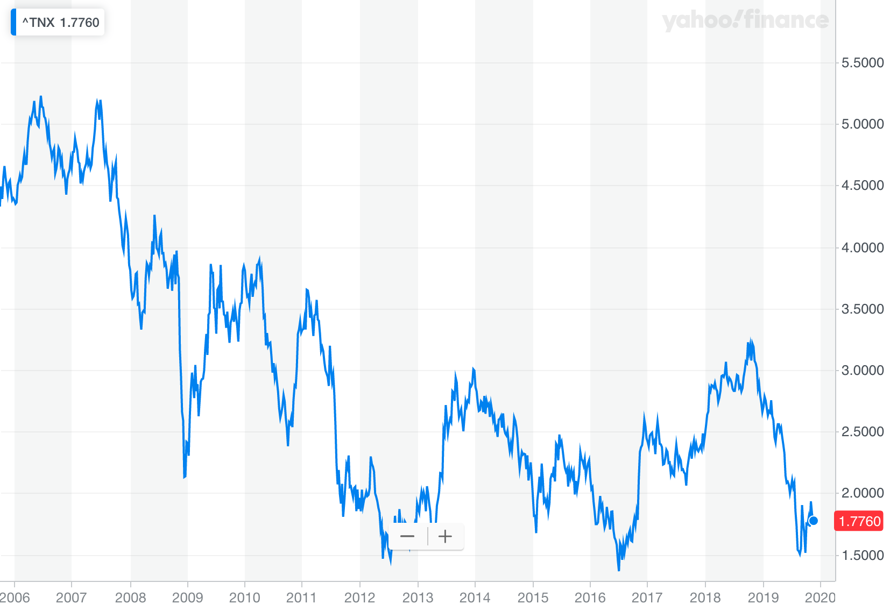
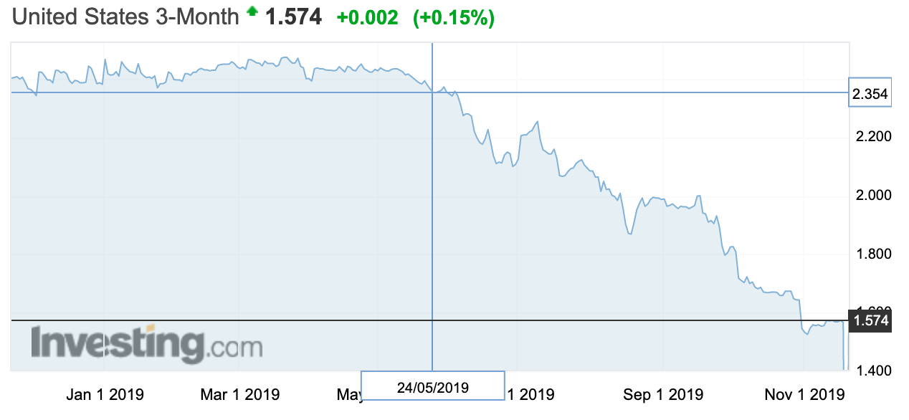

# Treasury Yields

## Treasury Yields

[Rising Treasury Yields Quiet Investors’ Concerns](<https://www.wsj.com/articles/rising-treasury-yields-quiet-investors-concerns-11573736400?mod=searchresults&page=1&pos=18>)

[Treasury Yields Extend Slide Amid Trade and Economic Concerns -- MarketWatch](<https://www.wsj.com/articles/german-bund-yields-drop-despite-better-than-expected-3q-gdp-data-11573717845?mod=searchresults&page=1&pos=17>)

### Increasing during Oct. 2019

Those include the Federal Reserve’s cuts to short-term interest rates, steps toward a trade agreement by the U.S. and China and a series of economic reports that turned out better than some investors had feared.

Some investors say the rise of 10-year yieldsabove three-month yields is a positive sign forthe economy.

Yields on longer-term Treasurys also slipped below shorter-term yields, a phenomenon known as an inverted yield-curve, which has proved one of the financial markets’ best predictors of a looming recession.

The 10-year yield remains very low—sitting closer to the all-time low of 1.366% it reached in 2016 than the 3.2% level it briefly hit about a year ago when the Fed was still raising interest rates.

Nonetheless, many investors think yields have room to rise as more people sell bonds to buy riskier assets. 

- cuts to short-term interest rates
- a trade agreement by the U.S. and China

Postive signal for economy, from reverted to higher than 3-month rate

Maybe still low, since money out of debts into riskier assets

### Recent Decrease

U.S. Treasury yields slipped Thursday as investors eyed **weakening economic data in Asia**, along with **political jitters** around the globe and **uncertain progress** toward a partial U.S.-China trade pact.

**Weak in Euro**

The U.K.’s economic performance was the worst since July 2016 with manufacturing and services PMI both coming in below 50 and below expectations. Britain faces a general election on December 12.

The 10-year German government bond yield was down 2.7 basis points to negative 0.357%. Trading in German debt can serve <u>as a proxy for haven demand</u> within the eurozone, and often moves in sync with the Treasurys market.

...